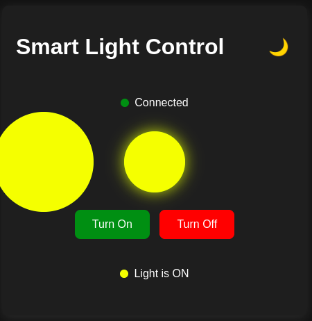
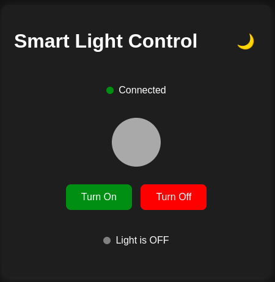

# MQTT Light Control Project

A simple IoT project that demonstrates MQTT communication between a web interface and a simulated IoT device. Control a virtual light bulb from your browser and see real-time updates in a Python GUI.

## Screenshots

<div align="center">
  <table>
    <tr>
      <td align="center"><b>Web Interface</b></td>
      <td align="center"><b>Python GUI</b></td>
    </tr>
    <tr>
      <td></td>
      <td></td>
    </tr>
  </table>
</div>

## Project Overview

This project consists of two main components:

1. **Web Interface (index.html)**: A browser-based UI with ON/OFF buttons to control a virtual light
2. **Simulated IoT Device (light_simulation.py)**: A Python script that simulates an IoT device (like an ESP8266)

Both components communicate via MQTT (Message Queuing Telemetry Transport), a lightweight messaging protocol designed for IoT applications.

## Features

- Modern, responsive web interface with dark mode support
- Real-time communication between web browser and Python script
- Visual feedback with animated light bulb
- Connection status indicators
- Detailed error handling and reporting
- Python GUI for visualizing light status

## Prerequisites

Before running this project, you need:

1. **Python 3.6+** with the following packages:
   - `paho-mqtt` (MQTT client for Python)
   - `pillow` (Python Imaging Library - PIL fork)
   - `tkinter` (Usually comes with Python, but may need separate installation on some systems)

2. **Web Browser** (Chrome, Firefox, Edge, etc.)

3. **HiveMQ Account** (Optional - already configured with test account)
   - The project is pre-configured with test credentials
   - For your own setup, create an account at [HiveMQ Cloud](https://www.hivemq.com/cloud/)

## Installation

1. **Clone the repository**:
   ```
   git clone https://github.com/yourusername/mqtt-light-control.git
   cd mqtt-light-control
   ```

2. **Install Python dependencies**:
   ```
   pip install paho-mqtt pillow
   ```

3. **Install tkinter** (if not already installed):
   - **Windows**: Typically included with Python installation
   - **macOS**: `brew install python-tk`
   - **Ubuntu/Debian**: `sudo apt-get install python3-tk`
   - **Fedora**: `sudo dnf install python3-tkinter`

## Running the Project

### Step 1: Start the Simulated IoT Device

1. Open a terminal/command prompt
2. Navigate to the project directory
3. Run the Python script:
   ```
   python light_simulation.py
   ```
4. A GUI window will open showing the light status and connection information

### Step 2: Open the Web Interface

1. Open the `index.html` file in your web browser:
   - Double-click the file, or
   - Drag and drop it into your browser, or
   - Use a local server if you have one

2. You should see the light control interface with:
   - A light bulb visualization
   - ON and OFF buttons
   - Connection status indicator

### Step 3: Control the Light

1. Click the "Turn ON" button in the web interface
   - The light bulb in the browser will turn on
   - The Python GUI will show: "💡 Light is TURNED ON"

2. Click the "Turn OFF" button in the web interface
   - The light bulb in the browser will turn off
   - The Python GUI will show: "💡 Light is TURNED OFF"

## How It Works

### Web Interface (index.html)

The web interface uses:
- MQTT.js to connect to the HiveMQ broker via WebSockets
- Bootstrap and custom CSS for styling
- JavaScript for interactivity and MQTT communication

When you click a button:
1. The browser publishes an "ON" or "OFF" message to the topic `/raphael/light_control`
2. The interface updates to show the current state

### Simulated IoT Device (light_simulation.py)

The Python script:
1. Connects to the same HiveMQ broker using the paho-mqtt library
2. Subscribes to the `/raphael/light_control` topic
3. Displays the light status in a GUI window
4. Updates the GUI in real-time when it receives "ON" or "OFF" commands

## Troubleshooting

### Connection Issues

If you see "Authorization failed" or connection errors:

1. **Check Internet Connection**:
   - Ensure you have a stable internet connection

2. **Firewall Settings**:
   - Make sure your firewall allows WebSocket connections on port 8884

3. **Browser Console**:
   - Open your browser's developer console (F12) to see detailed error messages

### Python Script Issues

If the Python script fails to connect:

1. **Check Dependencies**:
   - Ensure all dependencies are installed: `pip install paho-mqtt pillow`
   - Verify tkinter is installed by running `python -m tkinter` in your terminal

2. **TLS/SSL Issues**:
   - Make sure your Python environment supports TLS connections

3. **GUI Issues**:
   - If the GUI doesn't display properly, try using the "Reconnect" button
   - Check the terminal for any error messages

## Customization

### Changing MQTT Broker

To use your own MQTT broker:

1. Edit `light_simulation.py`:
   - Update the `BROKER`, `PORT`, `USERNAME`, and `PASSWORD` constants

2. Edit `index.html`:
   - Find the MQTT connection section and update the connection URL and credentials

### Changing the Topic

To use a different topic:

1. Edit `light_simulation.py`:
   - Update the `TOPIC` constant

2. Edit `index.html`:
   - Update the `topic` variable
   - Update the topic check in the message handler

## License

Feel free to clone and use this project.

## Acknowledgments

- HiveMQ for providing a free MQTT broker
- MQTT.js for the browser-based MQTT client
- Paho for the Python MQTT client
- Tkinter and Pillow for the Python GUI
# Light-control-mqtt
